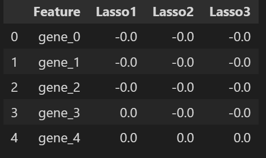
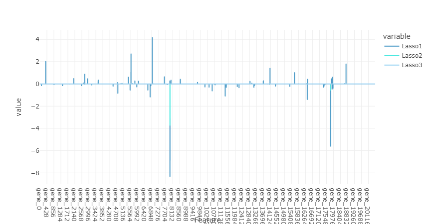
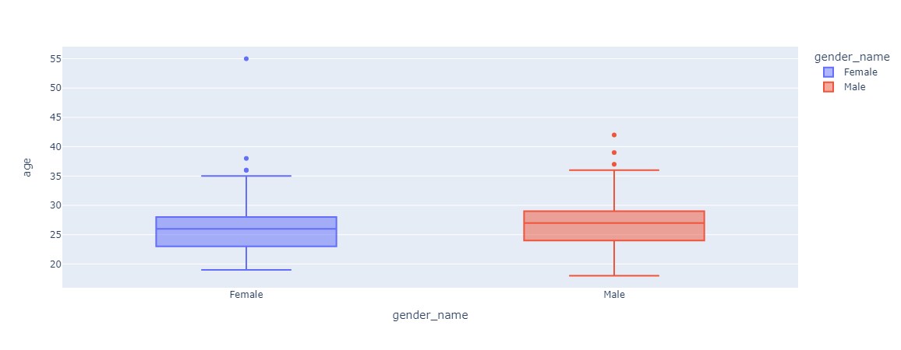
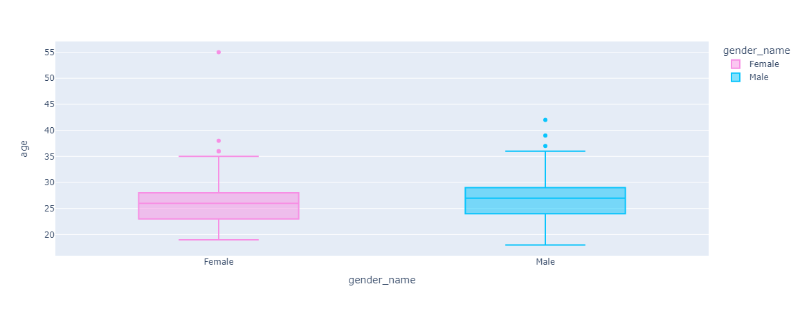

# ENCYCLOPEDIA

template to use for examples of code:
```python

```

## Shortcuts

### VS Code

Shift+Tab to remove tab before line of code

## Markdown

### How to insert an image into a markdown file

```python
# The syntax is the following:


# For example:

```
Which gives the following result:


## Python itself (pure)

### How to check if a calculation is correct

````python 

def addition(a, b, c):
    return a + b == c
# you can pass variables containing numbers as arguments in a function that returns a mathematical equality. After the calculation is done, if the result is correct, the function will return True, and if the result is incorrect, it will return False.

# for the function defined above: 

addition(1, 3, 58) # will return False

addition(1, 3, 4) # will return True

````

### How to generate random number (integer) in a given range

````python

import random
random.randint()
random.randint(0, 10) will return a random number from [0, 1, 2, 3, 4, 5, 6, 7, 8 ,9, 10].

````

### How to get text that is found after a certain word or character set (using .split()).

````python
text = "Guests can visit the nearby theaters, Gaumont and UCG cinemas"

text.split("the")
# splits the text into parts with the "the" substring used as delimiter.
# the method returns a list whose elements are the parts resulting from the split.
# the substring in the paretheses is left out.
# the number of splits is equal to the number of times the delimiter substring
# is found in the sting:
# output: ['Guests can visit ', ' nearby ', 'aters, Gaumont and UCG cinemas']

text.split("the", maxsplit=1)
# you can avoid unwanted splits by indicating that only one split
# (the first time the substring is found) is made.
# output: ['Guests can visit ', ' nearby theaters, Gaumont and UCG cinemas']


````


### How to split text using several delimiters

````python

import re

string_to_split = "<HtmlResponse 200 https://www.booking.com/searchresults.en-us.html?ss=Bayeux&ssne=Bayeux&ssne_untouched=Bayeux>"
split_string = re.split(r'=|&', string_to_split)
# output:
#['<HtmlResponse 200 https://www.booking.com/searchresults.en-us.html?ss', 'Bayeux', 'ssne', 'Bayeux', 'ssne_untouched', 'Bayeux>']
# here, we have used regex exression to indicate signs that would serve as delimiters for splitting the string: "=" and "&". 
# re.split() here takes two arguments: 
# 1 - the regex expression containing the delimiters with "|" meaning "or"
# so that either of the delimiters can be used
# 2 - the name of the variable containing the string to split.

````
### How to remove characters at the beginning and the end of a string (strip())

````python

string = "    Yuliya   "
stripped_string = string.strip()
print(stripped_string)

# output: Yuliya
# .strip method allows removing characters at the beginning and at the end of a string.
# if no argument is passed, it removes spaces at the beginning and at the end of a string.
# .strip() without argumens also removes escape characters like \n\t\t\t\t or \n 
# (that you can encounter for example in text scraped from web pages)

````

### How to replace a certain term in a string with another term

````python

city_name = "Mont Saint Michel"
new_city_name = city_name.replace(" ", "+")
# output: 'Mont+Saint+Michel'
# .replace() method allows replaces of occurrences of a subsrting in a string.
# here, it takes two arguments: 1 - the substring to replace (here " ")
# 2 - the  string with which it should be replaced.

````

### RegEx (Regular Expressions)

````python

import re
# importing regex module
# regex = regular expression: a sequence of characters that can be used for search in strings

names = "Anna! Mark, Elisabeth# & ; Anthony: John"
clean_names = re.sub(r"[!\"#$%&()*+,-./:;<=>?@[\\\]^_`{|}~]+", "", names)
print(clean_names)

# output: Anna Mark Elisabeth   Anthony John
# .sub() function replaces a character or a set of characters with the characters/text of your choice.
# .sub() function takes the following parameters:
# 1- the character or here character set that is to be replaced;
# (the sequence between square brackets [!\"#$%&()*+,-./:;<=>?@[\\\]^_`{|}~] followed by a + 
# means that any of these characters can be found and replaced).
# 2 - the character chosen as a replacement; here it is "", an empty string
# 3 - the name of the variable containing the string in which you want to replace the characters.
# r before a string means that the string is to be treated as a raw string, which means all escape codes will be ignored.


````

### How to create a function (steps to follow)

1) Check that your code is working on small scale, ex. for one element of a list
or one row of the dataframe
2) Adujst your code so that it is working with the whole object you want to apply it to
ex. the whole list or the whole dataframe.
3) Replace the names of the variables specific to your program with more generic names 
(ex. df instead of weather_df, list instead of city_list). Check that the code is still working.
4) Format the code as a definition of a function. Call this function to check that the code is still working.
Due to generic variable names, you will be able to reuse this function if you encounter this task again.

### How to use enumerate with for loop

````python

list_of_numbers = [1, 10, 2, 20, 3, 30, 4, 40]
for i, number in enumerate(list_of_numbers):
    print(i, number)
    # i variable takes the value of each consecutive index in the range equal to the length of list_of_numbers variable
    # (as if you set: for i in range(len(list_of_numbers)))
    # you can use enumerate(list_of_numbers, start=1) to assign index 1 to the first element and not 0 as usual
    # number variable takes the value of each element of the list.
    # this allows to to iterate at the same time on the index and on the corresponding element of the list
````

Output:
0 1
1 10
2 2
3 20
4 3
5 30
6 4
7 40

### How to get a zipped list (iterator for parallel iteration)
````python

numbers = [1, 2, 3]
letters = ['a', 'b', 'c']
zipped_iterator = zip(numbers, letters)
# .zip() function creates an iterator object that stores a list of tuples
# belongs to a special zip class

print(zipped_iterator)
# returns not the list itself but the address of the iterator object in memory
# here: <zip object at 0x000002CDE3453D40>

print(list(zipped_iterator))
# to see the elements inside the iterator, use .list()
# which here returns : [(1, 'a'), (2, 'b'), (3, 'c')]

````

### How to get length of dictionary (and what it means)

````python

len(dictionary)
# returns the number of keys in the dictionary

````

## Imports, libraries

````python
````

## Pandas (dataframes)

### How to avoid getting "Unnamed:0" column when opening a .csv file

````python

df.to_csv("df.csv", index=False)
# When saving the .csv file
````

### How to take a sample (a certain number of random rows) from dataframe

````python

sample_size = 1000
data = data.sample(sample_size)
# taking a sample of 1000 rows from dataframe

````

### How to iterate over a dataframe using indexes from another dataframe
Or: if you have a dataframe with features that is a subset (ex. a sample) of a greater dataframe,
with indexes that refer to the rows of the initial greater dataframe,
how to get the subset of labels that correspond to these rows?
(You cannot simply take a samlple of 1000 rows from your dataset with features and then a sample
of 1000 labels from your object containing labels, because these labels will be random
and will not necessarily correspond to the randomly selected rows).

````python 
df["target"] = bunch_dataset.target[df.index]
# here, the dataset is stored in a bunch (dictionary-like) object.
# bunch_dataset.target stores target labels (numbers) in the form of a 1-dimensional numpy array.
# df is a dataframe created from a sample of rows of a bigger dataframe containing features.
# The index has not been reset for this smaller df, so its rows retain the indices they had
# when they were still in the bigger dataframe.
# df.index stores these indices as a list of numbers. We use these indexes to find the rows of the 
# target label array that have the same indices and thus contain labels that correspond to the rows of the 
# sample dataframe.
# We create a new columns "target" in the sample dataframe. This column will contain the labels extracted
# from the bigger bunch_dataset.target array.

````

### How to create a dataframe from dictionary

````python

values_for_column_1 = [1, 2, 3]
values_for_column_2 = (4, 5, 6)
values_for_column_3 = [7, 8, 9]

data_dict = {
    'Column_1' : values_for_column_1,
    'Column_2' : values_for_column_2,
    'Column_3' : values_for_column_3
        }
# Create a dictionary where each item corresponds to the column name and values that are to be placed in that column.
# The key of the dictionary will be used as the column name in the future dataframe
# The values of the dictionary are the values that will be placed in the column. They can be a list, a tuple or a numpy array. In this example, it is the variable that contains a list.

dataframe = pd.DataFrame(data = data_dict)

# pass your variable that contains the dictionary as value for the data parameter

````

### How to create a dataframe from a list of tuples
```python

# data in the form of list of tuples
data = [('Name1', 32, 160),
        ('Name2', 38, 184),
        ('Name3', 15, 170)]
  
# create DataFrame using data
df = pd.DataFrame.from_records(data, columns =['Name', 'Age', 'Height'])

```

### How to load .json file to python as a list of dictionaries

````python

with open('C:\\Study\\Jedha\\Fullstack\\dmc_19_10_2022\\kayak_project\\result\\booking16_search_page.json') as hotels:

hotels = json.load(hotels)

# note theat there also exist json.loads() method that is used when json is not a 
````

### How to create a dataframe from list of dictionaries

````python

weekly_forecast_df = pd.DataFrame.from_records(weather_by_day)

````


### How to create a dataframe from columns of existing dataframe

````python

new_df = old_df[['column1','column2']]
# don't forget to use double square bracketse

````

### How to create a dataframe from lists

````python

import pandas as pd

values_list = [["Vanuatu", "Numea", "New Zealand"], ["Fiji", "Sumatra", "Tahiti"], ["Bikini", 
                "Timor", "Australia"], ["New Guinea", "Sri Lanka", None]]
index_list = [0, 1, 2, 3]
column_list = ["column_1", "column_2", "column_3"]

df = pd.DataFrame(values_list, index=index_list, columns=column_list)

# You need to pass the values of the future dataframe in the form of a list (here values_list).
# You should also pass the desired indices and column names as lists respectively (here index_list and column_list)
# The number of elements in the list of indexes is the number of rows in the future dataframe.
# The total number of elements in your values list should equal the product of the length of index list (here: 4) 
# multiplied by the length of the column list (here: 3). 
# If there are some missing values (ex: you have 11 values instead of 12), you should use a term such as None, otherwise pandas will not be able a create a dataframe.
# If you create several rows in the dataframe, you should create a nested list: a list whose elements are smaller lists.
# The number of such smaller lists is equal to the number of rows you are creating; 
# the number of elements in each of such smaller lists is equal to the number of columns you are creating.

````


### How to rename a column

````python

import pandas as pd
  
df.rename(columns = {'initial_column_name':'desired_column_name'}, inplace = True)

````

### How to join two dataframes on key (merge)

````python
new_df = left_df.merge(right_df, how="left")
# the left and the right dataframes should both a column with the same name. 
# This column will be used as a key.

````


### How to count number of unique values in a column

````python 

dataset['Column_name'].nunique()
# returns number (int) of unique values in the specified column

````

### How to drop a row containing a certain value

````python

df = df.drop(df[df["mileage"]==-64].index)
# Here, the row to drop contained value -64 in the colum "mileage". We use the index of the row in the dataframe
# to indicate which row should be dropped.
````

### How to select from dataframe values that satisfy a certain condition (with mask)

````python

mask = dataframe['Column_to_be_tested_for_condition'] != 0 
# returns the column (pandas series) with true and false values depending on the condition set .
# here we check which values of the 'Column_to_be_test_for_condition'  are equal or not equal to 0.
# here, the value returned in the column is False when value of 'Column_to_be_test_for_condition' is equal to 0 (=condition is not satisfied); and the value returned is True when value of 'Column_to_be_test_for_condition' is not equal to 0 (= condition is satisfied).

dataframe.loc[mask, 'Column_with_values_of_interest']
# here we use the mask to identify the rows that we want to preserve. We select the values in the 
#'Column_with_values_of_interest' that correspond to the rows where the mask has the value True
# this code returns a column (pandas series) that contains the selected values of interest.

dataframe[dataframe['Column_to_be_tested_for_condition'] != 0]
# here we create and apply mask in one line. Contrary to the previous example, the resulting table will keep all the columns
# [dataframe['Column_to_be_tested_for_condition'] != 0] is the mask.

useful_values_list = dataframe.loc[mask, 'Column_with_values_of_interest'].to_list()
# You can also save the values of interest as a list.

````
### How to convert a column with timestamp values to a column with datetime values

````python

def timestamp_to_datetime(df, column):
# function to convert 10-digit timestamp to datetime
    for row in range(0, len(df)):
        df.loc[row, column] = datetime.datetime.fromtimestamp(int(df.loc[row, column]))


timestamp_to_datetime(df_name, column_name)
# calling the function for your dataframe and for the column with timestamps to convert

````

### How to convert a column with string values to a column with float values

````python
df['colum'] = df['column'].astype(float)

````

### Lambda function

```python
df['col1'].apply(lambda x: "Yes" if x == 1 else "No") # [[ x = df['col1'][i] ]]

```

## Numpy (arrays)

### How to get number of dimensions of an array

````python

array_name.ndim
# .ndim attribute returns the number of dimensions of an array as integer

````

### How to get the shape of an array

````python

array_name.shape
# .shape attribute returns the shape of an array as a tuple.
# the number of elements in the tuple corresponds to the number of dimensions of the array

````

### How to understand the shape of an array (syntax)

````python

my_1d_array = numpy.array([1, 2, 3, 4, 5])
print(my_1d_array.shape)  
#returns (5,) -> 1 row and 5 columns

my_2d_array = numpy.array([[1, 2],[3, 4],[6,5]])
print(my_2D_array.shape)
#returns (3, 2) -> 3 rows and 2 columns 

````

### How to change shape of an array

````python

array_to_change = numpy.array([1,2,3,4,5,6])
array_to_change.shape = (3, 2)
print(array_to_change)
# changes the shape of the original array:
#[[1 2]
# [3 4]
# [5 6]]


my_array = numpy.array([1,2,3,4,5,6])
print(numpy.reshape(my_array,(3,2)))
# creates a reshaped copy of the original array
#[[1 2]
# [3 4]
# [5 6]]

````

### How to flatten an array

````python

my_array = numpy.array([[1,2,3],
                        [4,5,6]])
print(my_array.flatten())
# returns a flattened array: 1 dimension
# and for the example above, shape of (6,), that is 1 row and 6 columns
# you can also use .flatten() method for arrays of other shapes and of higher dimensions, 
# you still get 1-dimensional array as a result

````
### How to get unique values of an array

```` python
import numpy as np

np.unique(array_name)
# returns the list of array's unique values as a 1-dimensional array

````
### How to get the number of unique values of an array


```` python
import numpy as np

len(np.unique(array_name))
# returns the number of unique values of the array as an integer

````

## Preprocessing, EDA, basic statistics, cleaning
(see also DataViz)


### Print number of rows and number of columns in a dataset (in a user-friendly way)

```python

print("Number of rows : {}".format(dataset.shape[0]))
print("Number of columns : {}".format(dataset.shape[1]))

```

### How to count percentage of missing values
```python

100*dataset.isnull().sum()/dataset.shape[0]
# we multiply by 100 the number of missing values per column
# and divide by the number of rows in the dataset
# (0th value of the tuple that is returned by shape method of pandas)

```


### Null values

```python

dataset.isnull()

# returns dataset where values are replaced by True (meaning a null value) or False (meaning a not null value)

dataset.isnull().any()

# returns a list of columns with True (meanin there is a null value in the column) 
# or False (meaning no null values in the column) for each column name.

```

### How to count the number of missing values per column
```python

dataset.isnull().sum() 

# returns pandas.core.series.Series

```

### How to check if there are missing values in a dataset (count total sum of missing values)
```python

print("The following will be 'False' if there's no missing values in the dataset: ", dataset.isnull().any().any())
# returns False if there are non missing values in the dataset


# alternative:

dataset.isnull().sum().sum()
# returns number of missing values
# returns 0 if there are no missing values

```

### How to replace missing values in a column with zero (or any other value)

````python

df['Column'] = df['Column'].fillna(0) # pandas method for one column

df['Column'] = df['DataFrame Column'].replace(np.nan, 0) # numpy method for one column

df = df.fillna(value = 0).copy() # pandas method for the whole dataframe. You should make a copy of the dataframe and save it into a variable of the same or of diffrerent name, otherwise you will not be able to see the result if you apply without .copy() like that: df = df.fillna(value = 0)

````

### How to get perentage of occurrences of a certain value

````python

df['column'].value_counts(normalize=True)*100

# Output:

# Citroën        80.0
# Renault        20.0

````

### A dataframe cell contains a dictionary. How to split it into several columns ?

````python

column_keys = weekly_forecast_df["column"][0].keys()
# get the keys of the dictionary that is contained in a dataframe's cell
# here, the dictionary is contained in the cell situated in the 1st row (index 0) of the dataframe
# and in the columns named "column".
# we save the keys in the variable column_keys

for row in range(0, len(df)): 
    for key in column_keys:
        weekly_forecast_df.loc[row, "column"+key] = weekly_forecast_df["column"][row][key]
# we iterate over all rows of the dataframe. 
# For each row, we iterate over all keys of the dictionary contained in the column "column".
# We save the value corresponding to each key in a new column
# and name the newly created columns with names that include the name of the initial column and the key
# whose value is going to be stored in this new column.
# ex. the initial columns was called 'temp' and contained a dictionary with keys 'day', 'min', 'max', 'night', 'eve', 'morn'
# the columns resulting from the split will be named 'temp_day', 'temp_min', 'temp_max', 'temp_night', 'temp_eve', 'temp_morn'.


````

### How to count number of occurrences of each value in a column

````python 

df["Column_of_interest"].value_counts()

# returns a column (pandas series) with list of values 
# and, for each value, number of times it appears in the column.
````


### Separate target variable Y from features X

```python

target_variable = "target"
X = dataset.drop(target_variable, axis = 1) # we are dropping the column whose name is contained in target_variable
Y = dataset.loc[:,target_variable] # we are choosing all rows and only the column whose name is contained in target_variable

```

### How to automatically detect names of numeric and catigorical columns

```python

numeric_features = []
categorical_features = []
for i,t in X.dtypes.items():
    if ('float' in str(t)) or ('int' in str(t)) :
        numeric_features.append(i)
    else :
        categorical_features.append(i)

print('Found numeric features ', numeric_features)
print('Found categorical features ', categorical_features)

# This method determines whether a column should be categorized as numeric or categorical featue
# depending on the type of values it contains (columns containing int and float values are considered as numerical columns, columns containing other data types as categorical features).
# Be careful: some features can be expressed by numbers but be categorical in nature (ex. postal codes, IDs).
# Some features can treates as numeric as well as categorical (ex. 1st, 2nd, 3rd class of cabins on a ship).
```

### Train / test splitting

```python

from sklearn.model_selection import train_test_split

X_train, X_test, Y_train, Y_test = train_test_split(X, Y, test_size=0.2, random_state=0)


```

### Drop columns (pandas)
```python

columns_to_drop = ['column_to_drop_1', 'column_to_drop_2']
dataset = dataset.drop(columns_to_drop, axis=1) # axis=1 means that we are dropping columns

# alternative:
dataset = dataset.iloc[:,2:]
# the first argument : selects all rows
# the second argument 2: selects all columns except for the first two columns
# (i.e except for column 0 and column 1)

```

### Standardize numeric features using StandardScaler

````python

# import StandardScaler
from sklearn.preprocessing import  StandardScaler

# declare an instance of StandardScaler class
scaler = StandardScaler()

# the input is the train set in the form of pandas dataframe)
X_train = scaler.fit_transform(X_train)
# .fit_transform method is a combination two methods in one: .fit method computes, for each feature, the mean and standart deviation 
# that are going to be used for scaling, 
# .transform method applies the transformation on the train set
# the output is a numpy array

# the input is the test set in the form of pandas dataframe)
X_test = scaler.transform(X_test)
# apply the transformation on the test set
# there is no fitting as it would mean 
# the output is a numpy array
````

## Model training

## Regularization

### Ridge (Rigde Regression, Tikhonov regularisation)

````python

# import Ridge
from sklearn.linear_model import Ridge

# declare an instance of the Ridge class
ridge1 = Ridge()

# training the model
ridge1.fit(X_train, Y_train)
# Ridge tends to regularize the models by minimizing coefficients of different features

````

### R2 score for Ridge

````python

# method .score included in Ridge returns R2
ridge1.score(X_train, Y_train) # R2 for train set
ridge1.score(X_test, Y_test) # R2 for test set


````
### Lasso

````python

# import Lasso
from sklearn.linear_model import Lasso

# declare an instance of the Lasso class
lasso1 = Lasso()

# training the model
lasso1.fit(X_train, Y_train)
# Lasso tends to regularize the model by setting a lot of coefficients of different features to 0

````

### R2 score for Lasso

````python

# method .score included in Lasso returns R2

lasso1.score(X_train, Y_train)
print("R2 score on test set: ", lasso2.score(X_test, Y_test))

````

### GridSearch

````python

# Class allowing to search for best hyperparameters for optimizing a given model (estimator)
# can be used for different types of models and ensemble methods : Linear regression, Logistic regression, 
# Decision Trees, Adaboost etc.

# How to perform GridSearch:

# import GridSearch
from sklearn.model_selection import GridSearchCV
# GridSearchCV is a class with integrated cross-validation

#import the class for the model for which you want to find the best hyperparameters
# in this example, it is Ridge Regression
from sklearn.linear_model import Ridge

# declare an instance of the class of the model which you wish to regularize
regressor_ridge = Ridge()

# Indicate the grid of values of hyperparameters of the model to be tested
# the types of hyperparameters on which GridSearch is performed will be different
# depending on the estimator used and on the dataset. 
params_ridge = {
    'alpha': [0.01, 0.05, 0.1, 0.5, 1, 5, 10, 50, 100] # 0 corresponds to no regularization
}
# it is useful to specify a wide range of parameters first and then to adjust them 
# by looking at which value gives the best score

best_ridge = GridSearchCV(regressor_ridge, param_grid = params_ridge, cv = 5) 
# After the GridSearch finishes working, the variable (here named best_ridge) will contain the model (here Ridge regression)
# with the best hyperparameters determined by GridSearch (selected from the values that you specified above)
# cv : the number of folds to be used for cross-validation (the number of parts in which the train set is subdivided 
# into "train" and "test" sets for cross-validation)
# scoring: parameter of GridSearch that you can use to specify the desired score metric (R2, f1, accuracy etc 
# depending on the type of your model and on the use case).


best_ridge.fit(X_train, Y_train)
# Training the model with the best hyperparameters on the train set

best_ridge.best_params_
# .best_params_  is the attribute for getting the hyperparameters of the best model selected by GridSearch.

best_ridge.best_score_
# .best_score_ is the attribute that gives you the cross-validated score of the best model
# (i.e. the average score obtained after the specified number (ex: 5) of cross-validations)
# the exact scoring metric depends on the scoring parameter indicated for GridSearch (see above);
# if no scoring is indicated, the default score method of the estimator will be used
# (R2 for regressions, accuracy for classifiers). 
# In this example, Ridge being a regression model,you will get R2 score.

````

### How to get a classification report (with precision, recall, f-1, support, accuracy)

````python

from sklearn.metrics import classification_report

Y_test_pred = classifier.predict(X_test)
# store the predictions of your classification model (here called classifier) in a variable (here called Y_test_pred)

classification_report(Y_test, Y_test_pred, target_names = faces.target_names)
# classification_report() method takes: y_true parameter, that is correct target values (here: Y_test)
# y_pred, that is predicted targed values (here: Y_test_pred) as returned by a classifier,
# (optionally) names corresponding to the labels in the target; if not passed, returns labels
# returns a table with columns precision, recall, f1-score and support for each of the labels
# support is the number of occurrences of each class in y_true.

````


### How to persist (save) a model (sklearn)

````python

from joblib import dump, load
dump(model_name, 'filename.joblib') 
# the joblib file contains all information (coefficients, hyperparameters) needed to run the model.
# on person can develop the model, save its parameters in a joblib file, so that  another person is able to load the model from the joblib file and use this model for preditions directly by calling .predict() on the model.
# in order for this to work, the two persons must use the same image in a docker container.
# if you want to save the preprocessings too, use pipeline and dump to joblib, too.
````
### How to load a model from a joblib file

````python

model_name = load('filename.joblib') 

````


## DataViz, plots, visualizations

### How to plot coefficients of a model (or several models in the same figure)

````python

# declare and train (fit) your models as usual.
# in this example, three lasso models were trained.

data_dict_lasso = {
    "Feature": X.columns,
    'Lasso1': lasso1.coef_,
    'Lasso2': lasso2.coef_,
    'Lasso3': lasso3.coef_
            }
# create a dictionary where the first item has "Feature" as key and feature names (names of the columns of the X dataset) as values. 
# Here, feature names are a pandas Index type object
# other items consist of the name of the model as key and the coefficients corresponding to each feature as values.
# Here, coefficients for each model are a numpy array.


coefficients_lasso = pd.DataFrame(data = data_dict_lasso)
# Convert the dictionary into a dataframe. 
# the column titles of the dataframe will be "Feature" and the names of the model ("Lasso1", "Lasso2", "Lasso3")
# the lines of the dataframe will be the names of each feature and, for each of the models, the coefficients that 
# were determined for the given feature

coefficients_lasso.head()
````



````python

# It is normal that the visible parti of the dataframe is displayed with coefficients of 0 as Lasso tends to minimze the number of coeffients in a model by setting them to zero.

# Plot the coefficients using the dataframe you created:
import plotly.express as px

fig = px.line(coefficients_lasso, x = 'Feature', y = ['Lasso1', 'Lasso2', 'Lasso3'])
# The names of the features will be displayed along the horizontal axis
# the numerical values of coefficients for each model will be displayed vertically above each feature name

# display the plot.
#  as many coefficients are equal to zero, there is a lot of emptly space along the horizontal axis.
fig.show()
````



### How to display image without axis

````python

import matplotlib.pyplot as plt

plt.axis('off')
plt.imshow(faces.images[23])
# the parameter between paretheses in .imshow() corresponds to the object and the index of the element 
# containing the array that corresponds to the desired image

````

### How to show several images from an array with a for loop

````python

import matplotlib.pyplot as plt

fig, ax = plt.subplots(3, 5, figsize = (10, 10))
for i, axi in enumerate(ax.flat):
    axi.imshow(faces.images[i], cmap = 'bone')
    axi.set(xticks = [], yticks = [], xlabel = faces.target_names[faces.target[i]])

# the example is based on _labeled_faces_in_the_wild_dataset
# .subplots() method allows plotting multiple plots on the same figure.
# This method takes number of rows (here 3) and number of columns (here 5) as arguments
# and returns a tuple where the first element is fig and the second element is ax.
# fig: figure is an object used as a container for all the subplots, the entire frame within which the graphic(s) is contained
# ax: an object of the Axes class of matplotlib. It has the type of numpy array. 
# An Axes object is the region of the image with the data space, a graph inside your figure.
# A given figure can contain many Axes, but a given Axes object can only be in one figure. 
# An Axes objects contains 2 (or 3 in the case of 3D plots) Axis objects.
# ax.flat is a flattened collection of all axes.
# enumerate is used to iterate over the index (i) and the corresponding i-th element (stored in axi variable) of the collection of axes.
# to show a given i-th ax(here it is a photo), we apply .imshow() method to this ax (axi.imshow()).
# the parameters in the parentheses of imshow mean that we select the i-th 2d array (that corresponds to the image) 
# from the 3d array stored in variable images which in turn belongs to the bunch object faces.
# cmap is a parameter that allows choosing the desired color palette.
# .set() allows setting properties of the ax shown.
# xticks = [], yticks = [] means that no x or y axis and no ticks are shown.
# xlabel allows setting a horizontally oriented title under the image.
# here, we are looking for the name in the list target_names that corresponds 
# to the label in the target array associated with i-th image 

````

### How to use scientific perceptually uniform color maps of Fabio Crameri (batlow etc)

````python

pip install cmcrameri
# installing the library of color maps

import cmcrameri.cm as cmc
import matplotlib.pyplot as plt
# importing the color map library and matplotlib

plt.axis('off')
plt.imshow(faces.images[109], cmap = cmc.batlow)
# showing an image of _labeled_faces_in_the_wild_dataset with colormap batlow
# and without axis
````


### How to display confusion matrix of a classification model

````python

import matplotlib.pyplot as plt
from sklearn.metrics import ConfusionMatrixDisplay


_, ax = plt.subplots()
ax.set(title = "Confusion Matrix on Test set")
ConfusionMatrixDisplay.from_estimator(gridsearch, X_test, Y_test, ax=ax)
plt.show()
# using parameters of the model(estimator) to create a confusion matrix
# you need to indicate the name of the variable containing the model 
# whose confusion matrix you want to plot (here it is gridsearch),
# input values (here it is the array with features values = X_test),
# target_values (here it is the array Y_test)
# ax = ax : the first ax in this expression is a keyword argument.
# the second ax is the name of the variable that is passed as the value of this keyword argument
# the variable ax was declared in the 1st line : it is the second element of the 2-element tuple
# that is returned by .suplots() method.
# the underscore _ is a placeholder for figure, the first element of the tuple that is normally returned by .subplots() method.
# figure is not needed in this example as there is a single ax (graph), so 
# no variable for figure is created and underscore is used instead of the name of the variable.

````

### How to assign specific colors to each boxplot in plotly

```python

# I had a dataframe named "df_iid" presenting results of a speed dating experiment. Each line of the dataframe represented a participant, 
# and for each participant, gender was indicated in the column "gender_name" (with values "Male" or "Female") and age in the column "age".
# I wanted to make a plot with two boxplots to show the distribution of ages for participants of each gender.
import plotly.express as px
fig = px.box(df_iid, x="gender_name", y="age", color="gender_name")
fig.show()

```
Result of the above code:



Plotly uses a default color palette for graphs, but in my case I wanted to stick to stereotypes as I found that blue color for women and red color for men might be confusing.

In such a case, a "color_discrete_sequence" parameter can be specified to indicate the colors you want to use. You can first check the order of the boxplots in the image and then list hex codes for colors you want to assign to each boxplot in the same order. 

```python
import plotly.express as px
fig = px.box(df_iid, x="gender_name", y="age", color="gender_name", color_discrete_sequence=["#F78FE4", "#08C4FC"]) # the first hex code is for the pink color, the second one is for the blue color
fig.show()
```
Result of the above code:



## GitHub 

## Docker, images, deployment

### How to run a docker container to display a streamlit app locally

````python

# First create a Dockerfile (without extension).

# Example of Dockerfile allowing to run a streamplit web app:

FROM continuumio/miniconda3

WORKDIR /home/app

RUN apt-get update
RUN apt-get install nano unzip
RUN apt install curl -y

RUN curl -fsSL https://get.deta.dev/cli.sh | sh
RUN pip install boto3 pandas gunicorn streamlit sklearn matplotlib seaborn plotly
COPY . /home/app

CMD streamlit run --server.port $PORT app.py

# Build a docker image:
# enter the following command in the terminal (working for bash terminal):
docker build . -t data_science
# -t flag allows specifying image name (here "data_science")

# After the image is built, enter the following command in the (bash) terminal
# to start a container based on the image that has just been built
docker run -it -v "$(pwd):/home/app" -e PORT=80 -p 4000:80 data_science
# (equivalent to docker run -it -v "$(pwd):/home/app" -e PORT=80 -p 127.0.0.1:4000:80 data_science)
# -it is short for --interactive + --tty (=teletypewriter). When you docker run with this command it takes you straight inside the container.
# -v flag mounts the current working directory into the container. In this case
# the first field (the text before the colon, "$(pwd)" is the name of the volume (folder on the host machine), that is, in my case it is the folder in my global environment (Windows) that will be "connected" to the container: a file changed in this folder in the Windows environment will also be modified in the container; and vice versa.
# the second field (the text after the colon, /home/app is the path that allows locating in the container the same files that are located in the global environment).
# -e flag allows to specify the value of the environmental variable PORT (it is the variable mentioned in the CMD line of the Dockerfile above).
# -p flag here binds port 80 of the container to TCP port 4000 (on 127.0.0.1 in the case of Windows) of the host machine. 

# As soon is the container is started, you will then be able to see your app locally in your web brower
# at the address http://127.0.0.1:4000/ or http://localhost:4000/ if your global OS is Windows.
````

### How to run /bin/bash inside a docker container

````bash
# There are least 2 variants (many more in reality):

# 1) run /bin/bash when starting the container (in Ubuntu terminal):
docker run -it -d data_science /bin/bash
# "data_science" is the name of the image

# 2) first run the container separately, then attach bash to an already running container.
docker run -it data_science
# starting the container based on image named "data_science"

docker ps
# run this command in terminal to obtain the list of running containers.
# you will get output similar to the following:
CONTAINER ID   IMAGE          COMMAND     CREATED          STATUS          PORTS     NAMES
f2623795c284   data_science   "python3"   21 seconds ago   Up 21 seconds             vigilant_mendel

docker exec -it f2623795c284 /bin/bash
# "f2623795c284" si the id of the container
````

### How to run jupyter notebooks from docker terminal

````bash
# run the following commants in Ubuntu terminal
docker run -it -p 8888:8888 data_science /bin/bash
# create a container based on image called "data-science"
# flag -p 8888:8888 maps port 8888 to 8888 (exposes the Jupyter Notebook server on host port 8888). This port is used by Jupyter Lab to communicate with the client. It  is necessary to inticate this flag even after you have create a dockerfile containing a CMD command than starts Jupyter Notebooks server.
# /bin/bash launches a bash terminal in the container.

mkdir notebooks
# create a folder called "notebooks"

cd notebooks
# move inside the "notebooks" folder

jupyter notebook --ip=* --port=8888 --allow-root
# run this command to launch jupyter notebooks
# You'll get output of several lines where the final lines are similar to:
[I 14:22:32.376 NotebookApp] Jupyter Notebook 6.5.2 is running at:
[I 14:22:32.376 NotebookApp] http://611188ca5fbe:8888/?token=37a8d8ebb6c49b216c6cc4e540daa5dbeefcc976828b1136
[I 14:22:32.377 NotebookApp]  or http://127.0.0.1:8888/?token=37a8d8ebb6c49b216c6cc4e540daa5dbeefcc976828b1136
# if you go to http://127.0.0.1:8888/?token=37a8d8ebb6c49b216c6cc4e540daa5dbeefcc976828b1136, 
# you will be able to see jupyter notebooks locally in your browser.
````

### How to run a container with jupyter notebook server and a volume
````bash

$ docker run -it -p 8888:8888 -v C:/Study/Jedha/Fullstack/depl_d3_12_12_2022_docker/create_data_science_env/notebooks_host:/notebooks datascience
# syntax of the expression after -v flag:
# "C:/Study/Jedha/Fullstack/depl_d3_12_12_2022_docker/create_data_science_env/notebooks_host" (before the colon) is the folder on the host machine (global Windows environment) that is to be connected with the folder "notebooks"
# "datascience" is the name of the image used to create the container.
````